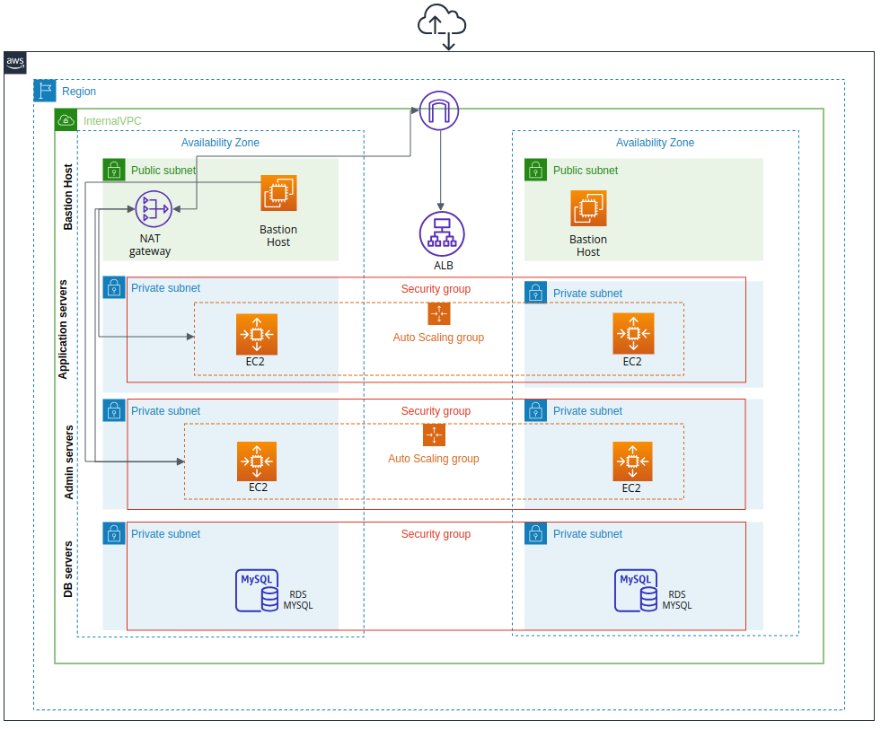

# Terraform-Challenge
## Description
This repository  contains Terraform code to deploy a secure, scalable AWS infrastructure for Travel Salmon. It includes VPCs, subnets, EC2 instances, RDS, and an Application Load Balancer. Follows best practices for security and resource management, supporting both development and production environments.

## Project Requirements

- Terraform: Ensure Terraform is installed and configured on your machine. <br>
- AWS CLI: Configure AWS CLI with appropriate credentials. <br>
- Access to AWS Account: Necessary permissions to create and manage resources in AWS. <br>
## Architecture diagram

The infrastructure is contained within a single VPC named InternalVPC. It is comprised of eight subnets across two availability zones, divided into “layers” of two subnets each:

**Layer 1 (Bastion Host):** Contains a bastion host, NAT gateway, and application load balancer, serving as the primary access point. <br>
**Layer 2 (Application servers ):** Hosts application servers that communicate securely with the RDS database. <br>
**Layer 3 (Admin servers):** Provides administrative access to application servers and the database without direct internet access. <br>
**Layer 4 (DB servers):** Houses MySQL databases accessible only by application and admin servers. <br>


Here's the architecture diagram:<br>


## Usage

To use the Terraform configurations in this repository, follow these general steps:

1. Configure the necessary variables and provider settings either in the main Terraform configuration or through variable files.
2. Initialize Terraform:

   ```bash
   terraform init
   ```

3. Preview the changes:

   ```bash
   terraform plan
   ```

4. Apply the changes:

   ```bash
   terraform apply
   ```
